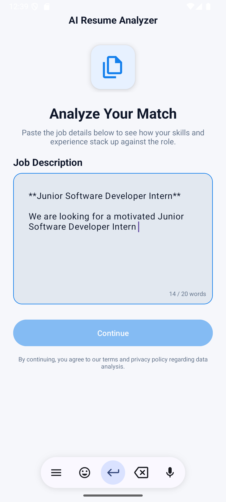
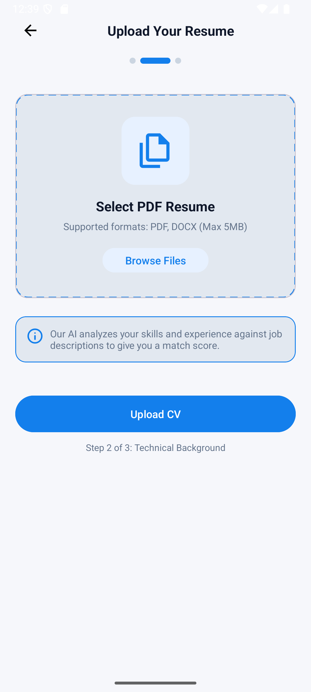
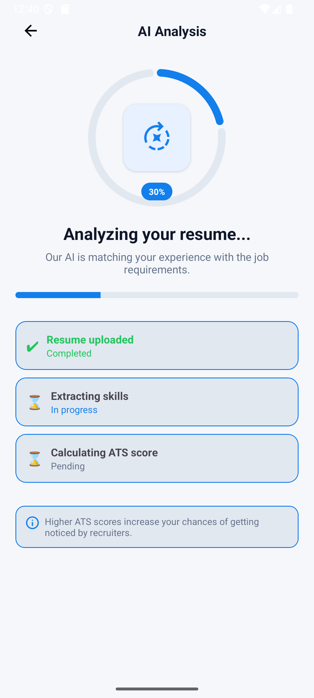
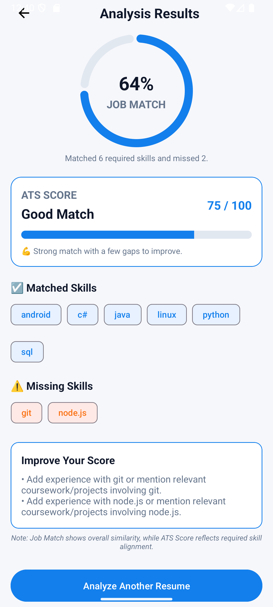

# AI Resume Analyzer

An AI-powered mobile application that analyzes resumes against job descriptions and provides ATS-style scoring, skill gap detection, and personalized improvement suggestions.

Built with a full-stack architecture combining Android, FastAPI, and NLP models, this project simulates how real-world recruitment systems evaluate candidates.

---

## 🚀 Why This Project?

Recruiters often use Applicant Tracking Systems (ATS) to filter resumes before human review.

This project replicates that process by:

* Extracting skills from resumes
* Matching them against job requirements
* Calculating an ATS-style score
* Providing actionable feedback to improve candidate success

---

## ✨ Key Highlights

* 📱 Full-stack system (Android + FastAPI backend)
* 🤖 Semantic similarity scoring using Sentence Transformers (BERT-based)
* 🧠 Hybrid approach: rule-based + AI-powered matching
* ⚡ Real-time resume analysis with interactive mobile UI
* 🧪 Automated backend testing with pytest

---

## 🧱 Architecture

1. User enters a job description in the mobile app
2. User uploads a resume (PDF)
3. Backend extracts text using `pdfminer.six`
4. Skills are detected using NLP-based matching
5. Semantic similarity is computed using BERT embeddings
6. ATS score and recommendations are generated
7. Results are displayed in the mobile app

---

## 📸 Screenshots

| Job Description                                            | Upload                                          |
| ---------------------------------------------------------- | ----------------------------------------------- |
|  |  |

| Loading                                           | Results                                           |
| ------------------------------------------------- | ------------------------------------------------- |
|  |  |

---

## 🎥 Demo


---

## 🛠 Tech Stack

### Backend

* FastAPI (REST API)
* pdfminer.six (PDF text extraction)
* Sentence Transformers (semantic similarity)
* scikit-learn (cosine similarity)
* pytest (testing)

### Mobile

* Kotlin (Android)
* Retrofit (API communication)
* Material UI components

---

## 🔌 API

### Health Check

`GET /health`

```json
{
  "status": "ok"
}
```

---

### Analyze Resume

`POST /analyze/`

**Form Data**

* `file`: resume PDF
* `job_description`: job description text

**Example Response**

```json
{
  "skills": ["python", "sql"],
  "required_skills": ["python", "sql", "aws"],
  "matched_skills": ["python", "sql"],
  "missing_skills": ["aws"],
  "ats_score": 66,
  "job_match": 0.72,
  "suggestions": [
    "Add experience with aws or mention relevant projects."
  ],
  "analysis_summary": "Matched 2 required skills and missed 1.",
  "recommendation_level": "fair"
}
```

---

## 🧪 Testing

Run backend tests:

```bash
python -m pytest
```

Includes:

* Skill extraction tests
* ATS score validation
* API response testing
* Health endpoint checks

---

## 📘 Deep Dive & Development Notes

For a detailed breakdown of the development process, architecture decisions, and technical challenges:

👉 **[Project Deep Dive (Notion)]((https://www.notion.so/AI-Resume-Analyzer-Project-Documentation-32d48838c2c080f89920ca28acebcd6e?source=copy_link))**

Includes:

* Architecture decisions
* Challenges & solutions
* Iteration process
* Trade-offs & improvements

---

## 🔮 Future Improvements

* Replace rule-based skill extraction with advanced NLP models (spaCy / transformers)
* Improve ATS scoring with weighted metrics and experience analysis
* Support DOCX and LinkedIn profile parsing
* Deploy backend and provide public demo
* Enhance recommendation system with context-aware feedback

---

## 🏁 Conclusion

This project demonstrates how AI can be applied to real-world hiring processes by combining mobile development, backend engineering, and machine learning into a single product.

---

## 👩‍💻 Author

**Begüm Şara Ünal**
